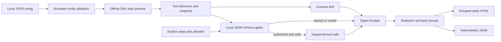

# Architecture

The execution boundary is the pair of local controls: a named case and allowlist membership. Schema discovery does not generate cases, and annotations do not grant permission. Commands and argument arrays pass directly to `StdioServerParameters`; server text never enters a shell.

The runner keeps one MCP session for deterministic sequential calls. A request timeout is recorded and the next case uses the same session, making recovery observable. Snapshot comparison identifies exact contract changes and only labels a rename when one removed and one added tool have identical contracts apart from name.

Initialization and the complete discovery loop have separate deadlines. Discovery also has hard page and tool-count limits, including protection against an endless stream of unique cursors. Schema inspection recursively rejects non-local references before any case reaches `ClientSession.call_tool`, preventing the SDK's cached output validator from fetching a discovered remote reference.
